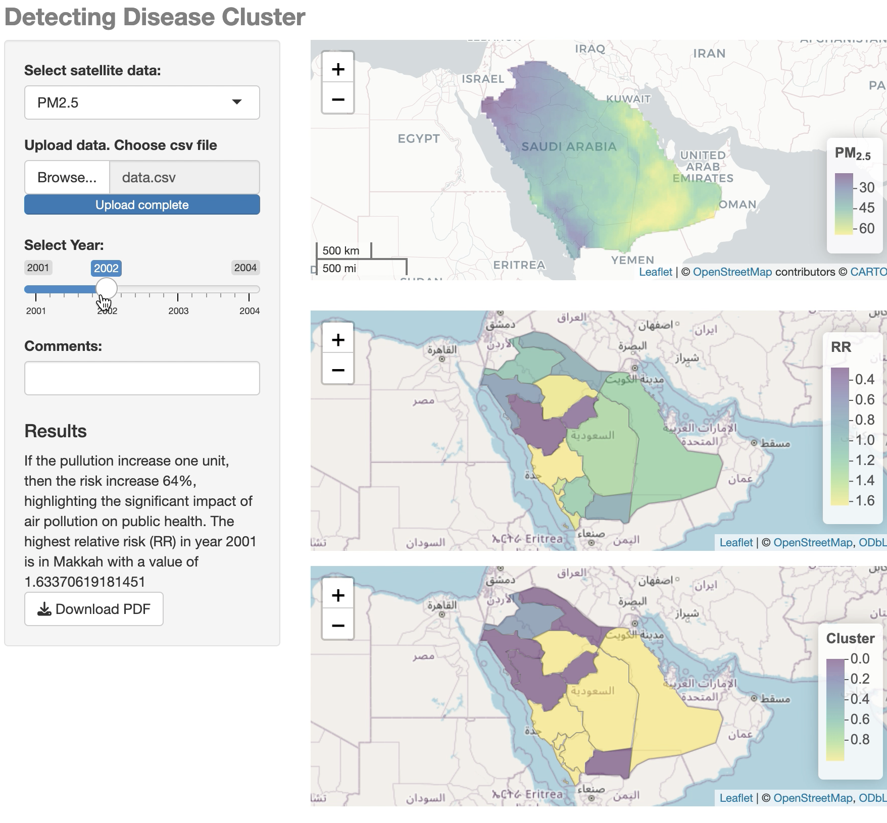
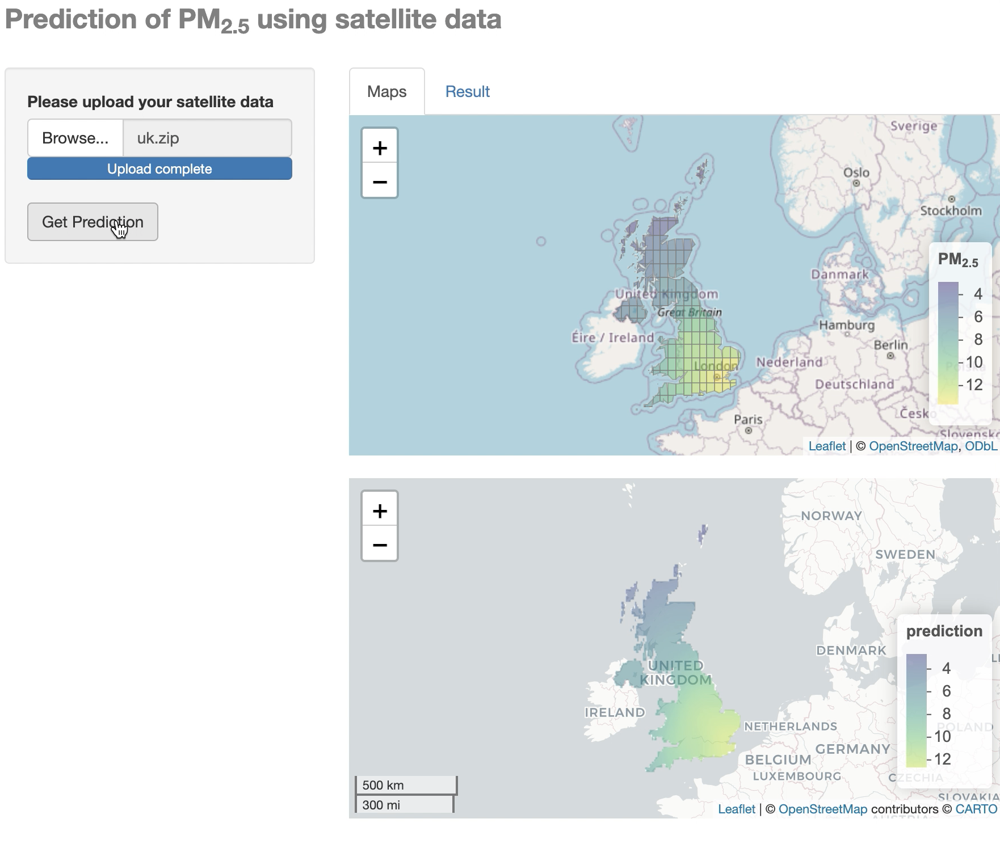

   <!-- Adds two line breaks to create space -->

# Detection disease cluster
   <!-- Adds two line breaks to create space -->

Our platform enables the detection of disease clusters by integrating satellite data with disease occurrence records. Users can upload their own data and visualize disease risks in different regions. The tool provides insights into how environmental factors like $PM_{2.5}$ pollution affect public health and highlights regions at risk, helping decision-makers prioritize healthcare efforts.

  
{width=50%}

   <!-- Adds two line breaks to create space -->

# Monitoring pollution
   <!-- Adds two line breaks to create space -->

We offer satellite-based pollution monitoring, allowing users to upload satellite data and receive  predictions of pollutant levels such as $PM_{2.5}$. Our platform generates detailed geographical maps that help identify pollution hotspots and assess the environmental impact across large regions. This data is essential for tracking pollution trends and enforcing environmental regulations.
  
{width=50%}

